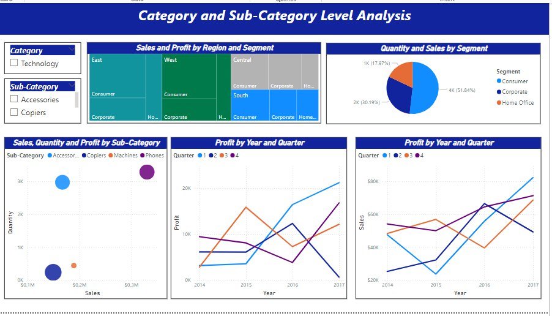

# Sales Dashboard

Welcome to the **Sales Dashboard**, an interactive tool designed to provide valuable insights into sales performance and trends. This dashboard helps users analyze sales data, track key metrics, and make data-driven decisions to boost sales performance.

## Demo





## Features

- **Interactive Visualizations**: Dynamic charts and graphs to explore sales data.
- **Sales Performance Tracking**: Monitor sales metrics such as total sales, growth rates, and targets.
- **Product Analysis**: Analyze sales performance by product category or individual items.
- **Geographical Insights**: Visualize sales data across different regions or locations.
- **Time-Based Analysis**: Track sales trends over different time periods (daily, monthly, yearly).
- **Customizable Reports**: Generate and customize sales reports to meet specific business needs.
- **Data Filtering**: Apply filters to view data based on date ranges, product categories, regions, and more.

## How to Use

1. Clone the repository to your local machine:
    ```bash
    git clone https://github.com/realakash140/Sales-Dashboard
    ```

2. Open the sales dashboard file (`Sales Dashboard.pbix` or relevant file) in [Microsoft Power BI Desktop](https://powerbi.microsoft.com/desktop/).

3. Interact with the dashboard using filters and slicers to analyze sales data and generate insights.

4. Export reports or share insights through Power BI service if needed.

## Requirements

- **Power BI Desktop**: Download and install from [here](https://powerbi.microsoft.com/desktop/).
- **Data Source**: The dashboard utilizes sales data, which can be updated or modified based on your dataset.

